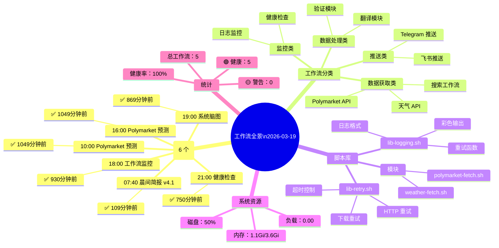

# 🧠 工作流脑图日报 | 2026-03-19

**生成时间：** 2026-03-19 09:30:01  
**健康评分：** 100/100

---

## 📊 工作流状态

| 工作流 | 执行时间 | 状态 |
|--------|----------|------|
| 晨间简报 v4.1 | 07:40 | ✅ 109分钟前 |
| Polymarket 预测 | 10:00 & 16:00 | ✅ 1049分钟前 |
| 工作流监控 | 18:00 | ✅ 930分钟前 |
| 系统脑图 | 19:00 | ✅ 869分钟前 |
| 健康检查 | 21:00 | ✅ 750分钟前 |

---

## 📈 统计

| 指标 | 数值 |
|------|------|
| 总工作流 | 5 |
| 🟢 健康 | 5 |
| 🟡 警告 | 0 |
| 健康率 | 100% |

---

## 🧠 脑图

---

## 📋 查看方式

### 1️⃣ Mermaid Live Editor
**网址：** https://mermaid.live

**步骤：**
1. 打开网站
2. 复制上方脑图代码
3. 自动渲染
4. 可导出 PNG/SVG

### 2️⃣ 飞书文档
飞书支持 Mermaid，直接粘贴即可渲染

### 3️⃣ 本地查看
- Obsidian（原生支持）
- VS Code + Mermaid 插件

---

**报告路径：** `/root/.openclaw/workspace/memory/reports/workflow-mindmap-2026-03-19.md`  
**脑图路径：** `/root/.openclaw/workspace/memory/reports/workflow-mindmap-2026-03-19.mmd`
